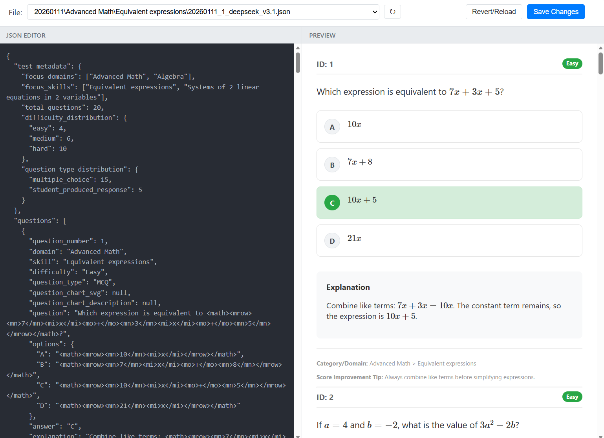

# Standard Operating Procedure: SAT Math Question Generation

This document outlines the workflow for generating, verifying, and finalizing SAT Math questions using AI assistants and the Review App.

## 1. Setup & File Creation
Initialize the workspace by creating the necessary placeholder files.

**Option A: Single Batch (Terminal)**
```powershell
# Adjust "TargetDir" and "Date" as needed
& "E:\TraeRepo\SAT-AI\QuestionBank\Math\create_question_files.ps1" -TargetDir "E:\TraeRepo\SAT-AI\QuestionBank\Math\Create\20260111" -Date "20260111" -Loops 3
```

**Option B: Multiple Batches**
Edit and run the helper script: `E:\TraeRepo\SAT-AI\QuestionBank\Math\Create\Create.ps1`

## 2. AI Generation
Generate raw questions using the defined prompts.

1.  **Context**: specific SAT Math sub-topic (e.g., "Advanced Math - Nonlinear Functions").
2.  **Action**:
    *   Open your AI Chat (DeepSeek, Gemini, Grok, etc.).
    *   Paste example questions (from PDF/Images) for context.
    *   Run Prompt 1: [Generator Prompt](./Prompt-Normal/1.SAT-Math-Question-Generator_based_on_pdf_examples.md)
3.  **Output**:
    *   Copy the JSON output.
    *   Paste into the corresponding `..._v3.1.json` file created in Step 1.

## 3. AI Verification
Audit the generated questions for accuracy and difficulty.

1.  **Quality Improving**:
    *   Review the `..._verified.md` file.
    *   Make necessary adjustments to the JSON file.
    *   run Prompt 2: [Verifier Prompt](./Prompt-Normal/2.SAT-Math-Question-Quality-Improvement.md)
    *   Save output to `..._verified.md`.
2.  **Content Check**:
    *   **New** Chat Session.
    *   Paste the generated JSON.
    *   Run Prompt 2: [Verifier Prompt](./Prompt-Normal/3.SAT-Math-Question-Verifier_based_on_pdf_examples.md)
    *   Save output to `..._verified.md`.
3.  **Difficulty Check**:
    *   In the same session, Run Prompt 3: [Difficulty Auditor](./4.SAT-Math-Question-Difficulty-Check.md)
    *   Append results to `..._verified.md`.

4.  **Chart Review**
    *   In the same session, Run Prompt 4: [Chart Reviewer](./5.SAT-Math-Question-SVG-Chark-Check.md)
    *   Append results to `..._verified.md`.
    ```prompt
    the svg chart not match the description of the question and explanation. Please note the svg y is verse to the y in math. Output the correct json file and use mathml
    
    ## add the json file here.
    
    ```

## 4. Human Review (Review App)
Visualize and finalize the questions using the local web application.

1.  **Start App**:
    ```powershell
    & "E:\TraeRepo\SAT-AI\QuestionBank\Math\ReviewApp\run.ps1"
    ```
2.  **Review Loop**:
    *   **Interface**: Open `http://localhost:5000` (or the URL provided in terminal).
    *   **Process**:
        *   **Left Panel**: Editor for the JSON file.
        *   **Right Panel**: Real-time rendering of the question.
        *   **Action**: Apply fixes from `_verified.md` (e.g., MathML formatting, explanation logic, difficulty adjustments).
    *   **Standard**: Ensure no "AI thoughts" remain in explanations and diagrams render correctly.
    
    

3.  **Finalize**:
    *   Move approved files from `Create` folder to `Ready` folder.

## 5. Deployment
1.  **Import**: Upload JSON files from `Ready` to the **ExamNexus AI Platform**.
2.  **Archive**: Move uploaded files to the `Imported` folder.


## Run generation in TRAE

```

Based on , run , output results to .


the svg chart not match the description of the question and explanation. Please note the svg y is verse to the y in math. Output the correct json file and use mathml

Improve quality of the question. Output the correct json file and use mathml

Based on , run , output results to .
Based on , run , append results to end of .


```
